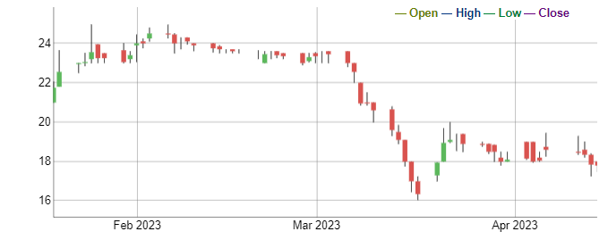
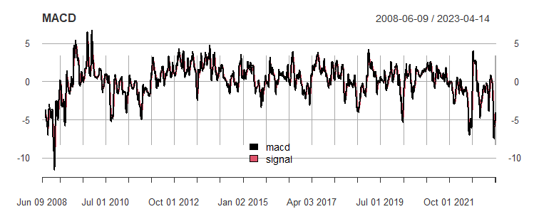
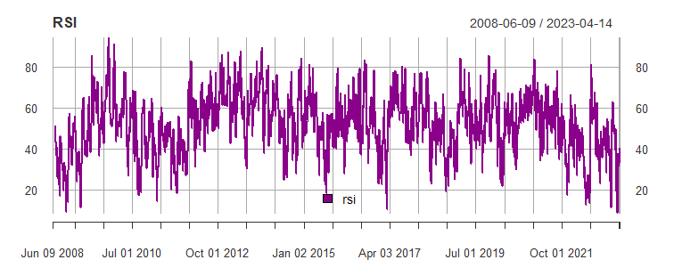
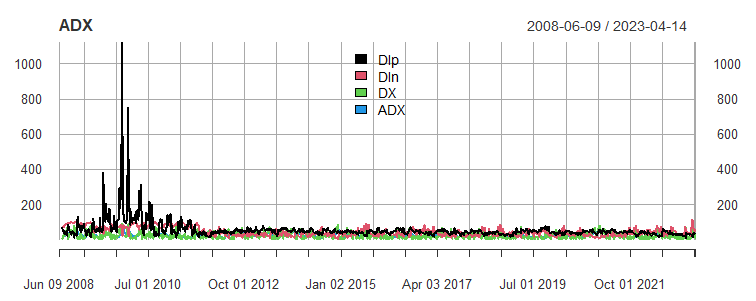
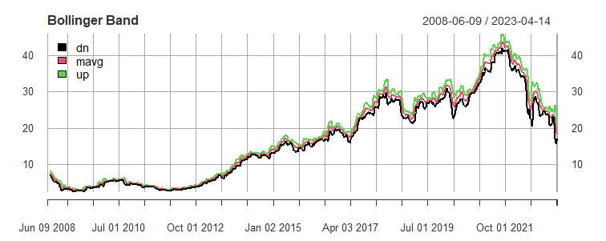
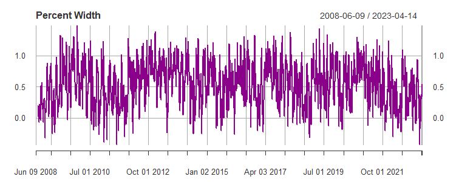

```{r setup, include=FALSE}
knitr::opts_chunk$set(echo = FALSE, fig.keep = 'last', warning = FALSE, message = FALSE, cache = FALSE,  comment = NA)
options(digits = 5)
source("Safaricom.R")
```

# Introduction

**Safaricom PLC**, a Kenyan mobile operator, was established in 1997 as a fully-owned subsidiary of Telkom Kenya. In 2000, Vodafone Group PLC, a UK-based telecommunications company, acquired a 40% stake in the firm and assumed management responsibilities. In 2008, the Kenyan government made 25% of Safaricom's shares available to the public via the Nairobi Securities Exchange, leading to its initial listing on the Nairobi Stock Exchange (NSE) in June of that year under the "SCOM" ticker symbol. As the largest telecommunications provider in Kenya and one of the most profitable companies in East and Central Africa, Safaricom is most well-known for its mobile banking SMS-based service, **MPESA**.

## Objective

The objective of this study is to use a machine learning algorithm to predict, the direction of Safaricom PLC's stock returns. By leveraging machine learning techniques and analyzing historical data on the company's stock prices and associated financial indicators, the study aims to identify patterns and trends that can predict future stock returns.

This study will also compare the different machine learning algorithms and choose the one with the highest accuracy. The data analysis was done in R.

# Data Preprocessing

```{r}
library(pacman)
p_load(dplyr, tidyr, ggplot2, readxl, quantmod, ModelMetrics, randomForest, rpart ,rpart.plot, moments, knitr, plotly, rayshader)
```

A glimpse of the first few rows of SCOM stock prices data is as shown below;

```{r}
# Importing the data
safaricom <- read_excel("stock_prices.xlsx")
safaricom$Date <- as.Date(safaricom$Date)
head(safaricom) %>% 
  kable()
```

The data contains 6 variables and 3,717 rows. The rows contains the different stock prices from June 9, 2008 to April 14, 2023. The 6 variables or columns contains the date, Open, high, low, close and Volume of the stock prices as can be seen above. The summary statistics are shown below;

```{r}

data.frame(
  mean = format(sapply(safaricom[, 2:ncol(safaricom)], mean), scientific = FALSE),
  variance = format(sapply(safaricom[, 2:ncol(safaricom)], var), scientific = TRUE),
  skewness = sapply(safaricom[, 2:ncol(safaricom)], skewness),
  kurtosis = sapply(safaricom[, 2:ncol(safaricom)], kurtosis)
) %>%
  kable()


```

The mean is the average value of each variable (Open, High, Low, Close, and Volume) in the data. Variance is a measure of how spread out the values are from the mean. A larger variance means that the values are more spread out, and a smaller variance means that the values are more tightly clustered around the mean. For example, the variance of the Open price is 138.60, meaning that the Open price varied quite a bit over the period of time covered by the data. Generally, the Open, high, low close and volume vaired over the time period evidences by the high variances.

skewness is the measure of the asymmetry of the distribution of values. A skewness of 0 means that the distribution is perfectly symmetrical, while positive or negative skewness means that the distribution is skewed to the right or left, respectively. For example, the skewness of the Open price is 0.36028, indicating a slight right skew.

kurtosis is the measure of the "peakedness" of the distribution of values. A kurtosis of 0 means that the distribution has a normal (bell-shaped) curve, while positive kurtosis means that the distribution is more peaked than normal, and negative kurtosis means that the distribution is flatter than normal. For example, the kurtosis of the Volume variable is 163.5541, indicating a very high level of peakedness in the distribution.

## Time series Plot

The time series plot of the Open, High, Low, and close are as shown below;

```{r, fig.width=7}
# We first convert data to long format

safaricom_long <- pivot_longer(
    safaricom[,1:5],
    cols = -Date,
    values_to = "price",
    names_to = "stock"
  )

K <- safaricom_long %>% 
  ggplot(aes(x  = Date)) +
  geom_line(aes(y = price, col = stock), linewidth = .7) +
  facet_wrap(~stock, ncol = 2) +
theme_minimal() +
  theme(axis.line = element_line(colour = "black"),
        axis.ticks = element_line(colour = "black", size = 1),
        axis.text = element_text(colour = "black"),
        plot.title = element_text(colour = "black", hjust = .5)) +
  guides(col = "none") +
  labs(title = "SCOM Stock Prices") 
(K)
```

Based on the time series plot, it appears that there was a discernible upward trend in the stock prices until approximately 2021, after which point the prices began to decrease. This suggests that some significant event or factor may have had an impact on investor sentiment, leading to a decline in demand for the stock. However, without further information about the specific stock, its industry, and the broader economic and political context in which it operates, it is difficult to draw definitive conclusions regarding the underlying causes of this trend. A more comprehensive analysis is necessary to fully understand the dynamics at play.

For this study, the closing price was selected for modelling. The plot below shows the time series plot of the stock returns

```{r, fig.width=7}
return_plot
```

## Feature Engineering

### The Dependent Variable

The dependent variable utilized in this study was the directional movement of stock returns. Specifically, if the returns of a given day were negative, this was denoted as "Down", while if the returns were positive, this was recorded as "Up". However, in instances where the returns were exactly equal to zero, these were also classified as "Down" for the sake of simplicity.

To provide further clarification, the designation of "Up" for positive returns is intended to convey the notion of profit, signifying a gain in value for the stock or asset being analyzed. Conversely, the classification of "Down" for negative returns denotes a loss or decline in value. The plot for the stock prices for the last 60 days is as shown below;



# The Independent Variables.

The following **technical indicators** were used as the independent variables.

## Moving Average Convergence Divergence (MACD)

The MACD is a trend-following momentum indicator that shows the relationship between two exponential moving averages. It is calculated by subtracting the 26-period Exponential Moving Average from the 12-period Exponential Moving Average.

When the Moving Average Convergence Divergence (MACD) line crosses from below to above the signal line (9-period Exponential Moving Average), it is considered to be a bullish signal. Conversely, when the MACD line crosses from above to below the signal line, it is considered bearish. A bullish MACD crossover indicates that the stock prices may experience an upward trend, whereas a bearish crossover suggests a possible downward trend.



## Relative Strength Index (RSI)

The RSI is a momentum oscillator that measures the strength and speed of a stock's price movements. It ranges from 0 to 100 and is calculated based on the average gains and losses over a specific time period. In simpler terms, it is used to measure the strength of stock price actions. It is calculated as the Ratio of Upward movement to Downward price movement over specified period of time.



## Average Directional Index (ADX)

The ADX indicator measures the strength of the trend in the stock prices. It's calculation results from;

1.  *DI+* - The +D measures the strength of upward price movement

2.  *DI-* - The -D measures the strength of downward price movement

3.  *DX* - The DX is the difference between the DI+ and DI-, divided by their sum, multiplied by 100.

The ADX indicator is calculated as the moving average of DX.



## Bollinger Bands

Bollinger Bands represent a commonly used indicator that closely monitors volatility. This dynamic indicator features three distinct lines, with a moving average placed in the middle and an upper and lower band situated at two standard deviations from the moving average. The bands are designed to track fluctuations in the stock price and provide valuable insights into whether the stock is overbought or oversold. Specifically, Bollinger Bands are useful for identifying times when a stock is performing outside of its normal range. When the stock price climbs above the upper band, it indicates that it is overbought and may be due for a pullback.



Also from the bollinger bands, there is the **percent Bandwidth**. It is calculated by dividing the difference between the current price and the lower Bollinger Band by the difference between the upper and lower Bollinger Bands. In terms of volatility, the percent B (%B) indicator provides a measure of how volatile a market is. When %B is high, it indicates that the market is volatile and prices are moving away from the moving average. Conversely, when %B is low, it indicates that the market is less volatile and prices are closer to the moving average.



## Stochastic Oscillator

The stochastic oscillator is a tool that helps investors understand how a stock's price compares to its price range over a certain period of time. It measures momentum and can help identify when a stock is overbought or oversold. There are three key indicators:

1.  *fastK* - which represents the stock's closing price compared to its range.

2.  *fastD* - which smooths out fluctuations in fastK.

3.  *slowD*- which further smoothes out the oscillator.

Values above 80 indicate an overbought condition, while values below 20 indicate an oversold condition.


Thus, the selected independent variables were;

1.  
